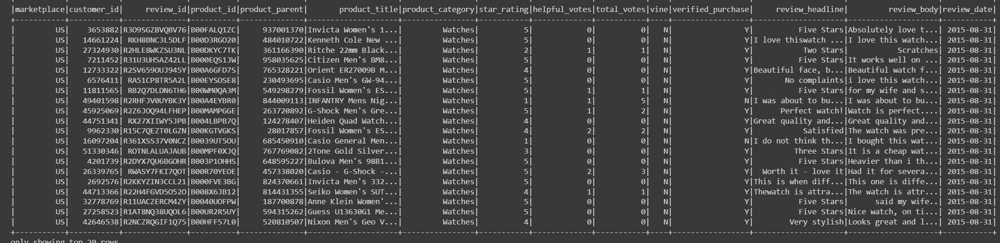
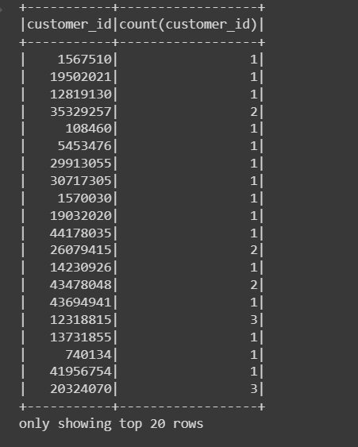
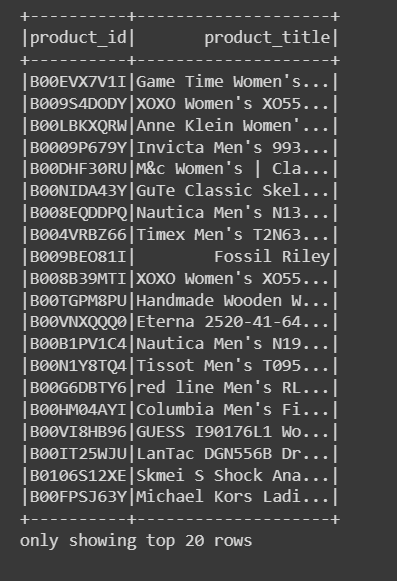
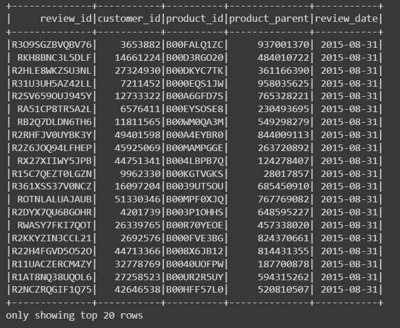
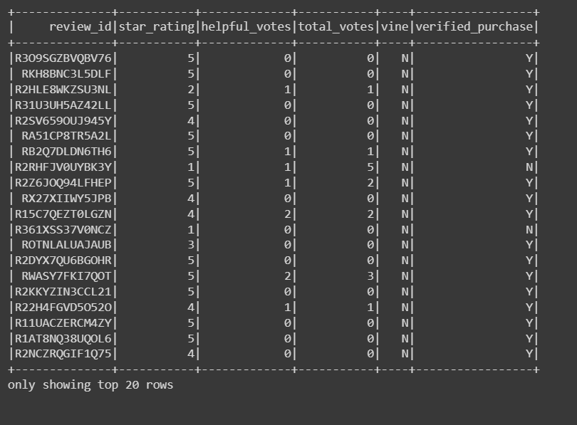

# Amazon_Vine_Analysis
## Overview of Project
In Amazon Vine analysis we are analyzing Amazon reviews written by members of the paid Amazon Vine program. The Amazon Vine program is a service that allows manufacturers and publishers to receive reviews for their products. Companies like SellBy pay a small fee to Amazon and provide products to Amazon Vine members, who are then required to publish a review.

## Analysis

Original df:

customers_table DataFrame:

products_table DataFrame:

review_id_table DataFrame:

vine_table DataFrame:

## Summary:
Amazon Vine Analysis

